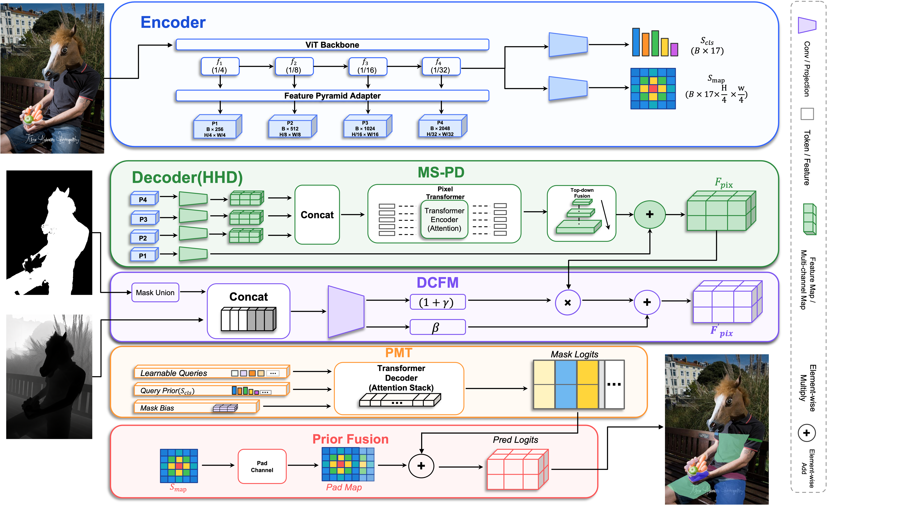

<p align="center">

  <h1 align="center">HyHOT: Learning Human-Centric Priors for Fine-Grained Human-Object Contact Segmentation
</h1>
  <p align="center">
    <strong>HybridHOT: Learning Human-Centric Priors for Fine-Grained Human-Object Contact Segmentation</strong>
  </p>
  <div align="center">
    
  </div>

## Installation

**Requirements:** Linux (tested on Ubuntu 20.04), Python 3.12, PyTorch 2.5.1 + torchvision 0.20.1 (CUDA 12.1). Our experiments were run on 8× NVIDIA RTX A6000 (48 GB).

```bash
git clone https://github.com/KeikiChen/HybridHOT.git && cd HybridHOT

# 1. Environment
uv venv --python 3.12 && source .venv/bin/activate

# 2. PyTorch (install first)
uv pip install torch==2.5.1 torchvision==0.20.1 --index-url https://download.pytorch.org/whl/cu121

# 3. Sapiens2 source code (do NOT pip install it)
git clone https://github.com/facebookresearch/sapiens2.git
git -C sapiens2 checkout 7e5bae88456ac418ff0e58e74106c9fe192055d4

# 4. Other dependencies
uv pip install -r requirements.txt

# 5. Sapiens2-0.4B checkpoint
hf download facebook/sapiens2-seg-0.4b sapiens2_0.4b_seg.safetensors --local-dir sapiens2/sapiens2_host

# 6. Check (expected: 2.5.1+cu121 True)
python -c "import torch; print(torch.__version__, torch.cuda.is_available())"
```

> [!NOTE]
> Do not run `pip install -e .` in `sapiens2/`. It requires `torch>=2.7` and would replace the PyTorch installed above. HyHOT imports Sapiens2 directly from `./sapiens2`.

## Data Preparation
- Data: download the HOT dataset from the [project website](https://hot.is.tue.mpg.de) and unzip to `/path/to/dataset`. Then:
```
cd ./data
mkdir HOT
ln -s /path/to/dataset ./data/HOT
```
The directory structure is as follows:

```
Project/
├── data/
|   |── HOT
|   |   |── HOT-Annotated
|   |   |   |── images
|   |   |   |── annotations
|   |   |   |── ...
|   |   |── HOT-Generated
|   |   |   |── images
|   |   |   |── annotations
|   |   |   |── ...
│   ├── hot_train.odgt
│   ├── hot_test.odgt
│   ├── ...

```

## Segmentation Model

We use the [SAM GitHub](https://github.com/paulguerrero/lang-sam) model to generate human masks and save them in the `./data/HOT/HOT-Annotated(HOT-Generated)/segments_lang_sam` directory.


## Depth Model
[ZoeDepth](https://github.com/isl-org/ZoeDepth) is used to generate depth map. [LaMa](https://hot.is.tue.mpg.de) model in combination with the human mask to reconstruct the occluded object information.
Developers need to install the environment according to the official instructions of [ZoeDepth](https://github.com/isl-org/ZoeDepth) and save the generated depth map to the `./data/HOT/HOT-Annotated(HOT-Generated)/depth` directory.
Please note that in order to keep the original image and the inpainting image at the same perspective, they need to be spliced ​​together and sent to the [ZoeDepth](https://github.com/isl-org/ZoeDepth) model.


## Sapiens2 Encoder
HyHOT uses the [Sapiens2](https://about.meta.com/realitylabs/codecavatars/sapiens) ViT backbone as the image encoder. The source code and the default checkpoint are set up in [Installation](#installation) (steps 3 and 5). Other checkpoints are listed in the Sapiens2 [MODEL_ZOO](https://github.com/facebookresearch/sapiens2/blob/main/docs/MODEL_ZOO.md). Put them under `./sapiens2/sapiens2_host/` and point `MODEL.pretrained` to the file.

Supported `MODEL.sapiens_arch` variants (set in `config/hot-sapiens-hyhot.yaml`):

| arch            | embed_dims | num_layers |
|-----------------|------------|------------|
| sapiens2_0.1b   | 768        | 12         |
| sapiens2_0.4b   | 1024       | 24         |
| sapiens2_0.8b   | 1280       | 32         |
| sapiens2_1b     | 1536       | 40         |
| sapiens2_5b     | 2432       | 56         |

The default config loads `sapiens2_0.4b` with pretrained weights at
`./sapiens2/sapiens2_host/sapiens2_0.4b_seg.safetensors`.


## Training
Single-node DDP (default: 8 GPUs):
```
sh ./train.sh
```
or launch manually:
```
CUDA_VISIBLE_DEVICES=0,1,2,3,4,5,6,7 \
torchrun --standalone --nproc_per_node=8 \
    train.py --cfg config/hot-sapiens-hyhot.yaml
```
To change which GPUs to use, edit `CUDA_VISIBLE_DEVICES` and `--nproc_per_node` accordingly.

You can change the parameters in `config/hot-sapiens-hyhot.yaml` to adjust the network training process.


## Evaluation
If you want to evaluate the effect of the test set on a specific epoch, you can use the following command:
```
sh ./test.sh
```
This loops over all epochs (1..20 by default). Edit the `EPOCH_NUM` variable or the `--epoch` argument in `test.sh` to evaluate a specific epoch.

After evaluating the model, use the following command to view the results. Note that this command will display the results of all epochs. If you evaluate the validation set first and then evaluate the test set of the specified epoch, the results displayed are the results of the validation set except for the specified test epoch.
```
sh ./show_loss.sh
```

## Citation
This paper has been accepted to ACCV 2026. The proceedings and arXiv version are not yet available; the BibTeX below will be updated once they are released.

If you find this work useful, please cite:

```bibtex
@inproceedings{chen2026hybridhot,
  author    = {Chen, Qihui and Chen, Junwen and Yanai, Keiji},
  title     = {{HybridHOT}: Learning Human-Centric Priors for Fine-Grained Human--Object Contact Segmentation},
  booktitle = {Proceedings of the Asian Conference on Computer Vision (ACCV)},
  year      = {2026}
}
```

## Acknowledgement
For the HOT model and dataset proposed by Chen et al., please click [HOT](https://github.com/yixchen/HOT) for details.
These depth maps and masks were generated following the method proposed by Wang et al. [P3HOT](https://arxiv.org/abs/2507.01630) (ICCV 2025) for details.
